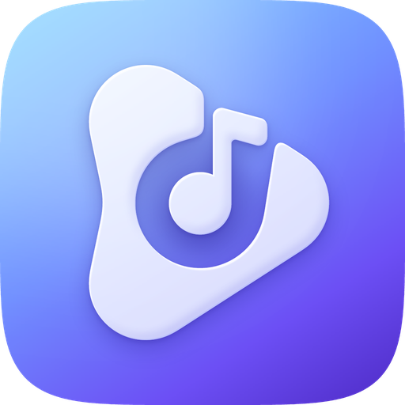

# PixlAudio for iOS

<p align="center">
  
</p>

A native iPhone music player — the iOS port of the PixlAudio Android app. Swift 6 and SwiftUI,
**Liquid Glass only**, built exclusively from Apple's system frameworks (no third-party code in the app).
Plays your own music (folders, Files, the DRM-free part of your music library), streams matched
tracks, and has the karaoke lyrics view from the Android app.

Version 1.0. Feature parity with Android is tracked in [`docs/parity.md`](docs/parity.md).

## Install

Download `PixlAudio-unsigned.ipa` from **Releases** and follow [`docs/INSTALL.md`](docs/INSTALL.md): an IPA
installer app on the iPhone or Sideloadly on Windows (free Apple ID), first-run setup, Spotify and what differs from
Android.

Requires iOS 26.1 or later (tuned for iOS 27).

## Building

There is no Mac in this project's workflow: GitHub Actions builds, tests, screenshots and packages
everything (`.github/workflows/ci.yml`). The Xcode project is generated from `project.yml` with
XcodeGen and never committed. Pure logic lives in `Packages/PixlCore` (zero dependencies), which also
builds and tests on Windows with Swift for Windows:

```
swift test --package-path Packages/PixlCore
```

Contributors: read [`AGENTS.md`](AGENTS.md) first.

## Built-in cloud keys

Cloud processing (instrumentals and word-timed lyrics on a RunPod GPU, songs through a Cloudflare R2 bucket) works
without any setup in builds made by this repository's CI: the app ships PixlAudio's own keys, encrypted, in
`App/Resources/CloudDefaults.enc`. The key that unlocks them is the `CLOUD_DEFAULTS_KEY` Actions secret, written into
the build just before it compiles (`ci/write-cloud-defaults-key.sh`) and never committed.

- Builds without that secret (forks, local builds) have no built-in keys: Cloud processing is off and asks for your
  own RunPod endpoint and R2 bucket, as before.
- Anyone can switch on **Use my own keys** and use their own instead; own keys always win.
- The built-in keys are limited on purpose: a Restricted RunPod key for one endpoint, an R2 key for one bucket, and at
  most $3 a month per iPhone. They are obfuscated, not secret: someone who takes the app apart can recover them.

The owner bakes or rotates them with `node tools/cloud/bake-cloud-keys.mjs` and checks them end to end with the
manual **cloud-e2e** workflow; see [`docs/handoff/2026-10-08-baked-keys.md`](docs/handoff/2026-10-08-baked-keys.md).
